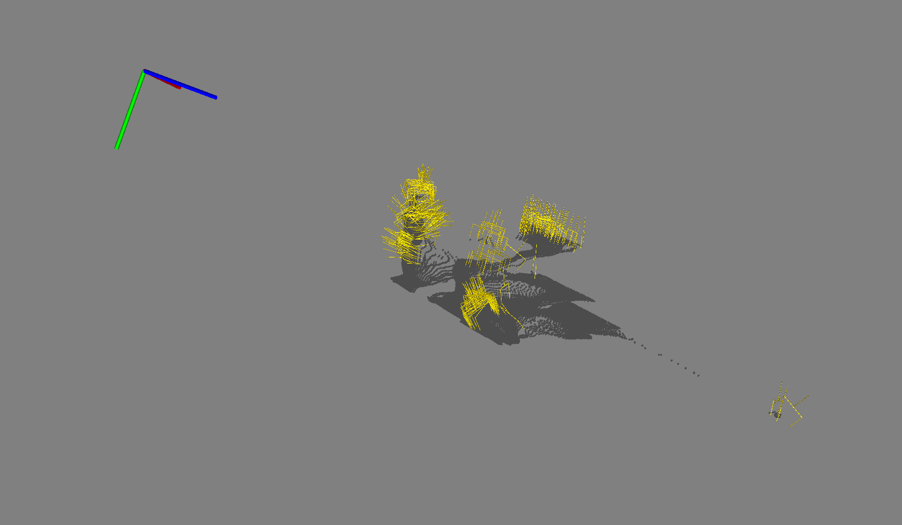
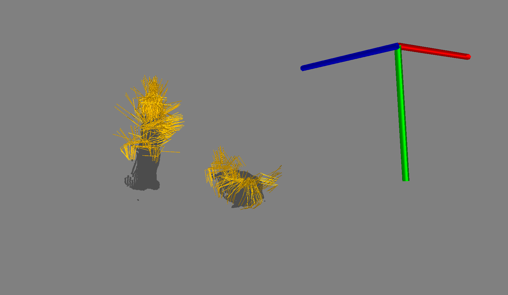
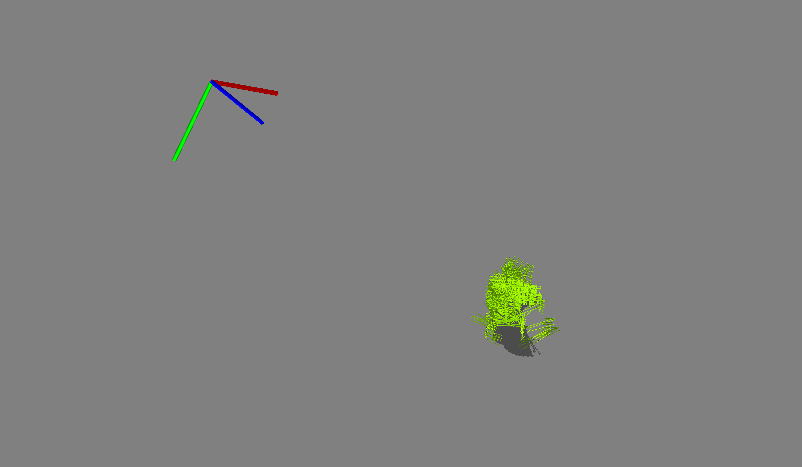
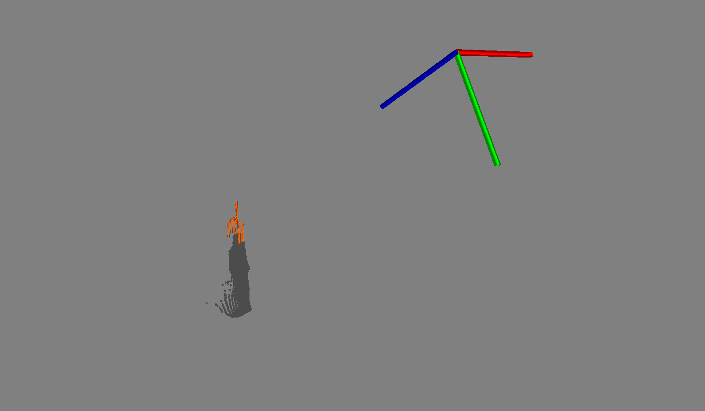
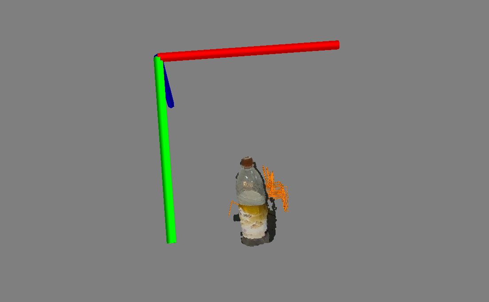
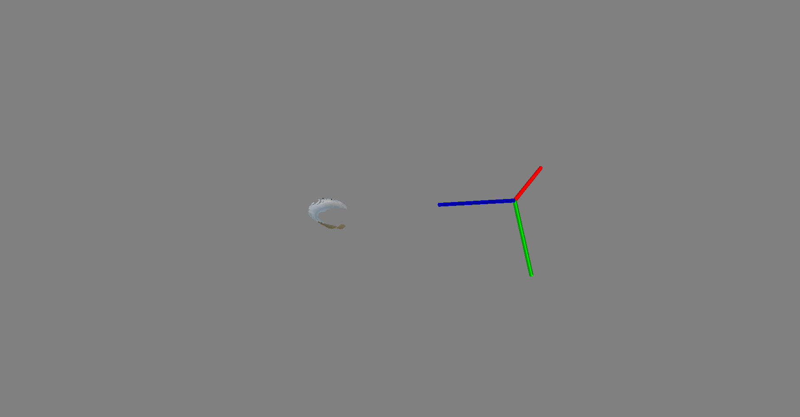

# Test Record

This is the documentation for the vision part of the project

## Initial Idea

The primary concept behind the implementation involves the direct mapping of bounding boxes obtained from the darknet model on the RGB image to the corresponding regions on the depth image. This process results in the creation of a depth image that encompasses all discernible objects positioned on the table, along with segments of the table itself, as confined by the bounding boxes.

In order to materialize these functionalities, the "object_depth_generation" package has been ingeniously devised. This package facilitates the extraction of relevant segments from the depth image based on the parameters of the bounding boxes. Additionally, the "npy_generator" package has been developed to facilitate the conversion of the depth image and associated camera information into a structured Python dictionary format. Subsequently, this dictionary is persisted into a .npy file format.

The resultant grasp candidates are visually represented in the figure presented below:

Certain candidates are situated upon the plane of the table, a situation that is considered unfavorable and undesirable.

## Plane Segmentation & Depth Image Converter

In order to address this concern, a process of plane segmentation has been implemented.

The "plane_segmentation" package subscribes to the point cloud data directly streamed from the realsense camera. Utilizing the RanSaC algorithm, this package effectively segments the plane corresponding to the table's surface. Consequently, the point cloud belonging to the objects can be identified as outliers and extracted accordingly.

For the purpose of converting the obtained point cloud into a depth image representation, the "depth_image_converter" module has been developed.

The figure below provides a visual depiction of the grasp candidates that have been generated:

With the successful implementation of plane segmentation, the issue of candidates situated on the table plane has been effectively resolved. However, a new challenge arises concerning the assignment of poses to their corresponding objects.

Despite the absence of candidates on the table plane, the association between specific poses and the respective objects they pertain to remains ambiguous. This necessitates further processing or identification methods to establish the precise correspondence between the generated poses and the objects they represent.

## Improvements

To effectively attribute specific objects to the grasp candidates, a refinement has been introduced within the "depth_image_converter" package. This enhancement involves the package now subscribing to an additional topic named "/hoi/target_object_name". This topic is anticipated to be populated by either a user or an AI agent responsible for decision-making.

With this update, the process of associating grasp candidates with designated objects is now comprehensive and functional. As a result, the overall set of functionalities required for the task has been successfully accomplished.

## Tests

To test the code, 3 objects are selected: box, bottle and bowl.

### Box

The result of box:

### Bottle

The results of bottle are very unstable, from time to time the contact graspnet gave good result:

It also cloud be the case that the generated poses are on the noise:

### Bowl

Because of the noise of realsense camera, the point cloud of the bowl is somehow "planed", and therefore no grasp candidate is generated.

